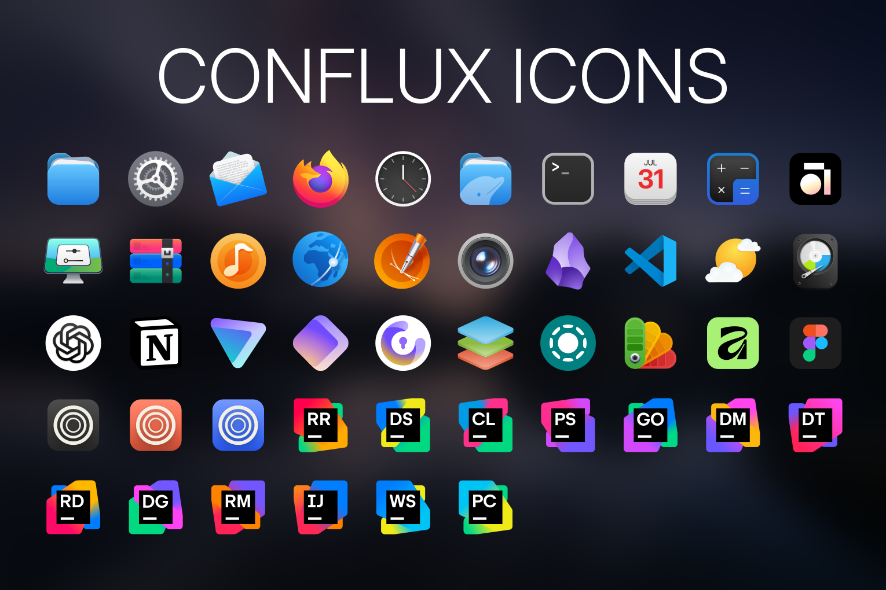
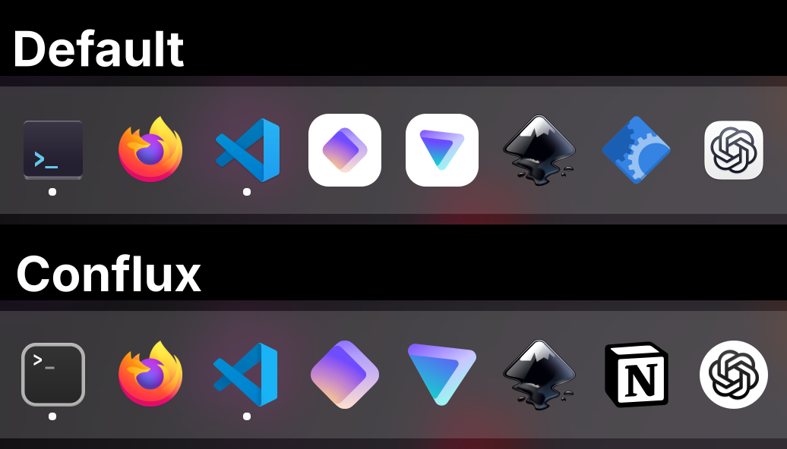

# Conflux Icon Theme

A beautiful, modern, and neutral icon theme for Linux that makes all icons feel at home together.



## Design goals

- **Modern, clean, beautiful icons**: The most important, of course.
- **Compatible with unthemed icons**: Icons that aren't included in Conflux should still fit in reasonably well.
- **Freeform shapes**: Icons are not necessarily bound to circle, square, squircle, or other fixed shapes. This allows more flexibility. Because Linux apps don't have some standard app icon design to follow, many of them have their own shapes; they should still fit in without looking out of place.
- **Preserve good icons**: Icons that are already well-designed and fit the style, or are recognizable logos (e.g. Firefox), aren't modified unless necessary or significant improvement is possible. Many icons are simply resized, repositioned, or have their background shape changed/removed. Some examples of this: 
- **Universal visual language**: Conflux doesn't follow some distinctive art style, but rather has a neutral, versatile visual language. This additionally keeps it compatible with unthemed icons.
- **Invisible**: Conflux should blend seamlessly into your system, so that you don't even notice you're using an icon theme.

## Installation

Copy or clone the repo to your icon directory:

```bash
mkdir -p ~/.local/share/icons   # Create the icon directory if you don't already have it
cd ~/.local/share/icons
git clone --depth=1 https://github.com/MoshiurRahmanAdib/Conflux-Icon-Theme.git Conflux # Clone the repo
```

Then, select the theme in your desktop environment's settings. You may need to log out and log back in for it to take effect.
To update it, just go to `~/.local/share/icons/Conflux/` and run `git pull`:

```bash
cd ~/.local/share/icons/Conflux
git pull
```

> [!NOTE]
>
> If you want to install system-wide (for all users), you need to install to `/usr/share/icons/` instead of `~/.local/share/icons/`

## About

I had a problem: I couldn't find a good, modern-looking icon theme for my desktop. All the ones I came across have an outdated style (or just poor design), and/or are too stylistic, making unthemed icons look out of place, and potentially changing the app's identity. So I tried to solve that with Conflux.

As I initially made this primarily for my use, I mostly added icons that I needed, with symlinks that work on my system. You can help expand it by [contributing](#contributing); you can also make [icon requests](#icon-requests).

## Sources and Attribution

See [CREDITS.md](CREDITS.md) for detailed attribution and information about sources.

A lot of icons are based on icons from other icon themes; credits to, among others, [WhiteSur](https://github.com/vinceliuice/WhiteSur-icon-theme), [McMuse](https://github.com/yeyushengfan258/McMuse-icon-theme), [Kora](https://github.com/bikass/kora), [MoreWaita](https://github.com/somepaulo/MoreWaita), [MacTahoe](https://github.com/vinceliuice/MacTahoe-icon-theme), and [Papirus](https://github.com/PapirusDevelopmentTeam/papirus-icon-theme)! There are original icons as well, and some are the original app icons with adjustments.

## Contributing

You can help expand this pack by contributing! You can make new icons, add missing symlinks, resize default icons for those that need it, polish the existing icons, fix [issues](https://github.com/MoshiurRahmanAdib/Conflux-Icon-Theme/issues), add requested icons, complete the [To-Dos](#to-do), or make it meet one of the [goals](#design-goals) better. If you think you can make a better version of an icon, feel free to suggest that as well (make sure it follows the requirements).

See [the wiki](https://github.com/MoshiurRahmanAdib/Conflux-Icon-Theme/wiki) for details about contributing, design guidelines, how you can make your own icons for this theme, and other resources.

## Icon Requests

If you want to request an icon, you can open an [issue](https://github.com/MoshiurRahmanAdib/Conflux-Icon-Theme/issues) (just follow the template). If instead you think you can make a good icon yourself, I encourage you to [contribute](#contributing)!

If you find some icon is present in the theme but is not applied because the app uses a different icon name on your system, create an [issue](https://github.com/MoshiurRahmanAdib/Conflux-Icon-Theme/issues) along with the icon name used on your system ([see this]()), or a pull request with the new symlinks.

See [this]() for more info.

## To-Do

[Issues](https://github.com/MoshiurRahmanAdib/Conflux-Icon-Theme/issues)

- [ ] Add a TUI script for options
    - [ ] Option to add app icon shadow
    - [ ] Folder colors / accent colors
- [ ] Better [places](places) icons
- [ ] Better [devices](devices) icons
- [ ] New 'software' (`software.svg`) icon

## Folders

### Workspace

In the [Workspace](Workspace) folder are the files used to make the icons, such as the Inkscape SVG files, the template, and source files. Icons are exported from there to the theme.

Inside Workspace, there is the [optimize.sh](Workspace/optimize.sh) script, where you can copy the exported SVGs to, and use the script to optimize.

Check [Workspace/README.md](Workspace/README.md) for more information.

## Wiki

There should be a lot of information in the [Wiki](https://github.com/MoshiurRahmanAdib/Conflux-Icon-Theme/wiki), go there if you're interested.

## License

See [LICENSE](LICENSE).